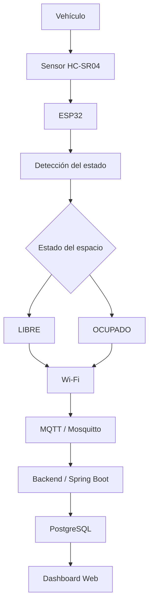

# **Sistema IoT de Gestión y Monitoreo de Espacios de Estacionamiento**

## **Integrantes**

1. Jonathan Madriz Sánchez
2. Luis Enrique Carmona Villafaña
3. Evelin Cruz López
4. Enrique Cruz Jiménez
5. Josué Sebastián Navarrete Garcia

---

## **Descripción del proyecto**

El **Sistema IoT de Gestión y Monitoreo de Espacios de Estacionamiento** consiste en el desarrollo de una solución tecnológica basada en el concepto de **Internet de las Cosas (IoT)**, cuyo propósito es automatizar la supervisión de los espacios disponibles dentro de un estacionamiento.

El sistema permitirá detectar automáticamente la presencia de vehículos en los diferentes espacios mediante sensores de distancia. La información obtenida será procesada por un microcontrolador **ESP32** y transmitida mediante una red inalámbrica utilizando el protocolo **MQTT**.

Posteriormente, los datos serán procesados por un servidor y almacenados en una base de datos, permitiendo mostrar el estado de los espacios mediante una interfaz web.

---

## **Propósito**

El propósito principal del proyecto es proporcionar un sistema automatizado que permita conocer en tiempo real la disponibilidad de los espacios dentro de un estacionamiento.

Actualmente, los conductores pueden tener dificultades para encontrar espacios disponibles, especialmente en estacionamientos de gran tamaño. Esta situación puede provocar pérdida de tiempo, recorridos innecesarios y congestión vehicular.

El sistema propuesto busca contribuir a la solución de este problema mediante la detección automática de vehículos y la visualización de la disponibilidad de los espacios en una interfaz digital.

---

## **Problemática**

En los estacionamientos de gran tamaño, como los ubicados en centros comerciales, instituciones o edificios, la búsqueda de espacios disponibles puede generar recorridos innecesarios dentro de las instalaciones.

La falta de información centralizada y actualizada sobre los espacios disponibles obliga a los conductores a recorrer diferentes áreas para localizar un lugar libre. Esto puede ocasionar pérdida de tiempo, mayor circulación vehicular dentro del estacionamiento y un uso poco eficiente de los espacios.

Por esta razón, se propone desarrollar un sistema capaz de detectar automáticamente el estado de cada espacio y proporcionar información actualizada sobre su disponibilidad.

---

## **Funcionamiento**

El sistema utilizará sensores ultrasónicos para detectar la presencia de vehículos en cada espacio de estacionamiento.

El funcionamiento general será el siguiente:

1. El sensor ultrasónico realizará una medición de distancia.
2. El **ESP32** recibirá y procesará la información.
3. El sistema determinará si el espacio se encuentra **LIBRE** u **OCUPADO**.
4. El ESP32 enviará el estado mediante una conexión Wi-Fi.
5. La información será transmitida utilizando el protocolo **MQTT**.
6. El servidor recibirá y procesará los datos.
7. La información será almacenada en una base de datos.
8. El estado de los espacios será mostrado en una interfaz web.

De esta manera, cuando un vehículo sea detectado dentro de un espacio, este será registrado como **OCUPADO**. Cuando no se detecte un vehículo, el espacio será registrado como **LIBRE**.

---

## **Flujo general del sistema**



---

## **Arquitectura general**

La arquitectura del sistema estará compuesta por cuatro partes principales:

### **1. Capa de adquisición**

Está formada por los sensores ultrasónicos y el ESP32. Esta capa obtiene información sobre la presencia de vehículos.

### **2. Capa de comunicación**

Utiliza Wi-Fi y MQTT para transmitir los datos desde el ESP32 hacia el servidor.

### **3. Capa de procesamiento y almacenamiento**

Está formada por el backend desarrollado con Spring Boot y la base de datos PostgreSQL. El backend procesa los datos recibidos y administra la información de los espacios.

### **4. Capa de visualización**

Consiste en una interfaz web que permitirá consultar el estado de los espacios y visualizar la disponibilidad del estacionamiento.

```text
+-----------------------+
|       VEHÍCULO        |
+-----------+-----------+
            |
            v
+-----------------------+
|     HC-SR04           |
|       SENSOR          |
+-----------+-----------+
            |
            v
+-----------------------+
|        ESP32          |
| Procesamiento local   |
+-----------+-----------+
            |
          Wi-Fi
            |
            v
+-----------------------+
|   MQTT / Mosquitto    |
+-----------+-----------+
            |
            v
+-----------------------+
|    Spring Boot        |
|       Backend         |
+-----------+-----------+
            |
            v
+-----------------------+
|     PostgreSQL        |
|      Base de datos    |
+-----------+-----------+
            |
            v
+-----------------------+
|     Dashboard Web     |
+-----------------------+
```

---

## **Objetivo general**

Diseñar e implementar un sistema IoT capaz de detectar y gestionar de forma automática la disponibilidad de espacios de estacionamiento mediante sensores y un ESP32, proporcionando información actualizada sobre los lugares libres y ocupados para facilitar la búsqueda de espacios y mejorar la administración del estacionamiento.

---

## **Objetivos específicos**

1. Detectar la presencia de vehículos en los espacios de estacionamiento mediante sensores ultrasónicos.
2. Procesar los datos obtenidos por los sensores para determinar si cada espacio se encuentra libre u ocupado.
3. Implementar un ESP32 como dispositivo de adquisición y procesamiento de los datos.
4. Establecer una comunicación inalámbrica entre los dispositivos IoT y el servidor mediante Wi-Fi y MQTT.
5. Almacenar la información de los espacios de estacionamiento para generar un historial de ocupación.
6. Desarrollar una interfaz web que permita visualizar el estado de los espacios en tiempo real.
7. Evaluar el funcionamiento del prototipo mediante pruebas de detección y clasificación de espacios.

---

## **Componentes principales**

### **Hardware**

* **ESP32**
* **HC-SR04**
* **LEDs**
* **Resistencias**
* **Protoboard**
* **Cables Dupont**
* **Fuente de alimentación**

### **Software**

* **Arduino IDE**
* **Mosquitto**
* **Spring Boot**
* **PostgreSQL**
* **Frontend web**

### **Tecnologías de comunicación**

* **Wi-Fi**
* **MQTT**
* **HTTP/REST**

---

## **Resultado esperado**

Se espera desarrollar un prototipo funcional capaz de detectar automáticamente el estado de los espacios de estacionamiento y mostrar esta información en una interfaz web.

Por ejemplo:

```text
ESTACIONAMIENTO

Espacio 1 → LIBRE
Espacio 2 → OCUPADO
Espacio 3 → LIBRE
Espacio 4 → OCUPADO
Espacio 5 → LIBRE
```

Resumen:

```text
Espacios disponibles: 3
Espacios ocupados:    2
Total de espacios:    5
```

La información deberá actualizarse conforme los sensores detecten cambios en los espacios de estacionamiento.

---

## **Alcance del proyecto**

El proyecto se desarrollará inicialmente como un **prototipo funcional** de un estacionamiento inteligente.

La primera versión estará enfocada en:

* Detección de vehículos.
* Identificación de espacios libres y ocupados.
* Comunicación mediante Wi-Fi.
* Transmisión de datos mediante MQTT.
* Almacenamiento de información.
* Visualización mediante una interfaz web.

Como posibles mejoras futuras se contempla la incorporación de funcionalidades como reservación de espacios, estadísticas avanzadas, predicción de disponibilidad y reconocimiento de placas.

---

